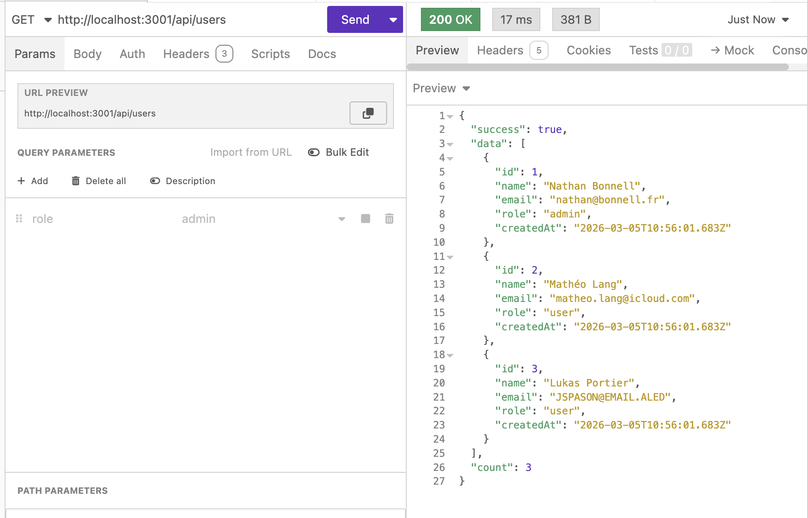
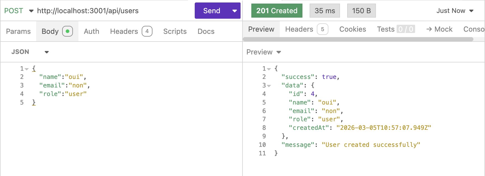
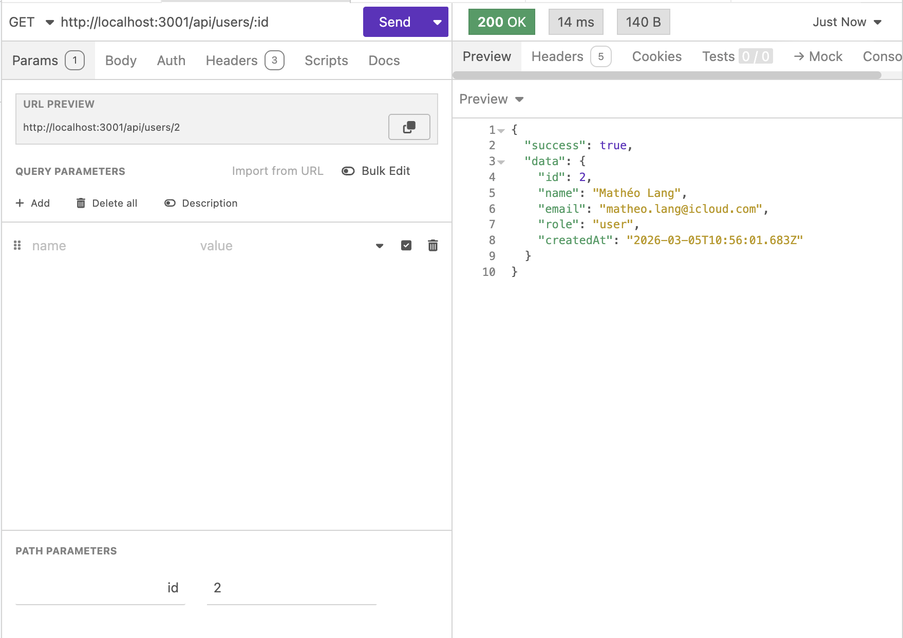
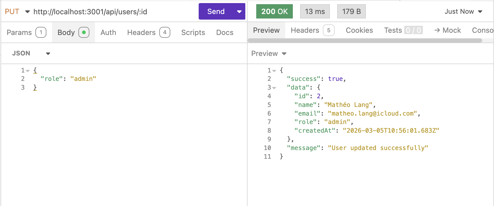
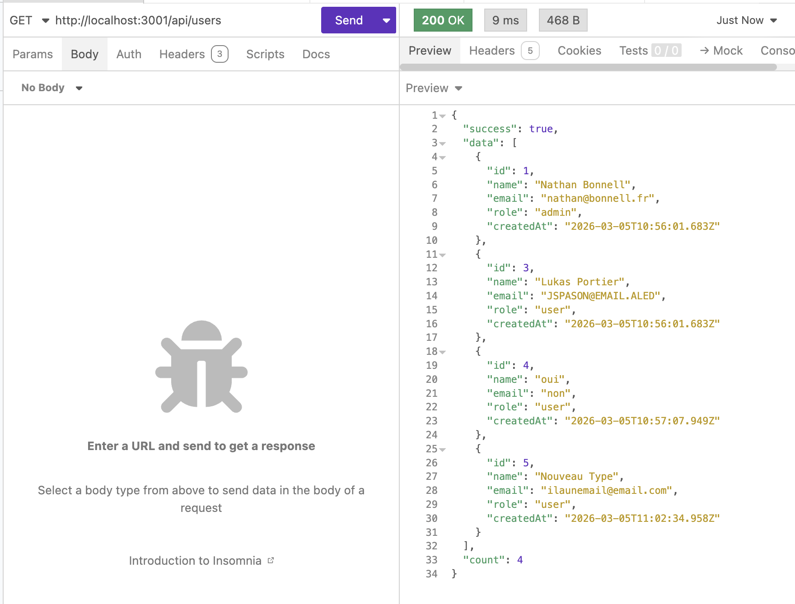
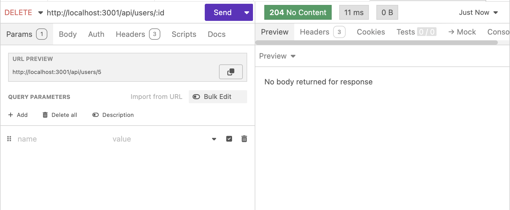
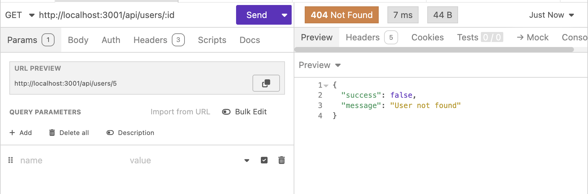

# TP 2 — Bonnell Nathan

API REST développée avec **Bun**, **Express** et **TypeScript** permettant de gérer des utilisateurs.

## Prérequis

- [Bun](https://bun.sh/) installé sur la machine

## Installation

```bash
bun install
```

## Lancement

```bash
bun run index.ts
```

Le serveur démarre sur le port **3001**. L'API est accessible à l'adresse `http://localhost:3001/api/users`.

## Endpoints

| Méthode | Route             | Description                         | Paramètres                              |
|---------|-------------------|-------------------------------------|-----------------------------------------|
| GET     | `/api/users`      | Récupérer tous les utilisateurs     | `?role=admin\|user` *(optionnel)*       |
| GET     | `/api/users/:id`  | Récupérer un utilisateur par son id | —                                       |
| POST    | `/api/users`      | Créer un nouvel utilisateur         | Body : `name`, `email`, `role`          |
| PUT     | `/api/users/:id`  | Modifier un utilisateur             | Body : `name`, `email`, `role` *(optionnels)* |
| DELETE  | `/api/users/:id`  | Supprimer un utilisateur            | —                                       |

## Scénarios de test

1. **GET /api/users** — Vérifier que les 3 utilisateurs initiaux sont retournés `200`



2. **POST /api/users** — Créer un nouvel utilisateur et noter l'id retourné `201`



3. **GET /api/users/:id** — Récupérer l'utilisateur créé avec son id `200`



4. **PUT /api/users/:id** — Modifier le rôle de cet utilisateur `200`



5. **GET /api/users** — Vérifier que la liste contient maintenant 4 utilisateurs `200`



6. **DELETE /api/users/:id** — Supprimer l'utilisateur créé `204`



7. **GET /api/users/:id** — Tenter de récupérer l'utilisateur supprimé `404`


