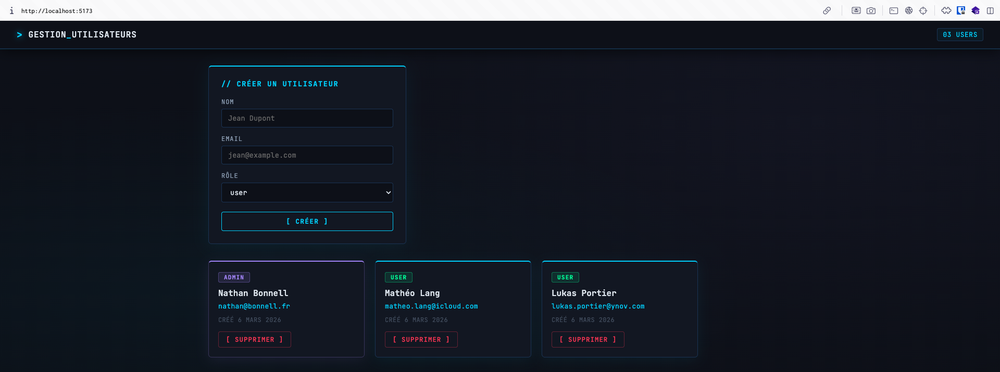
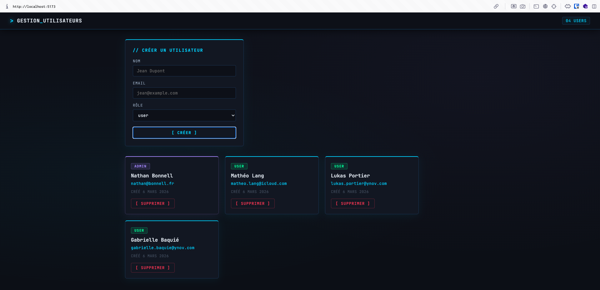
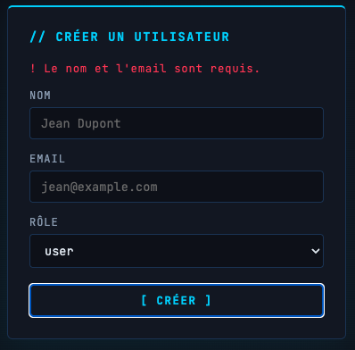
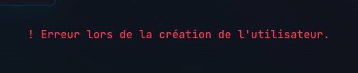
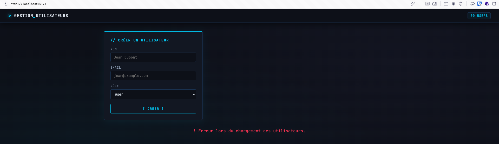
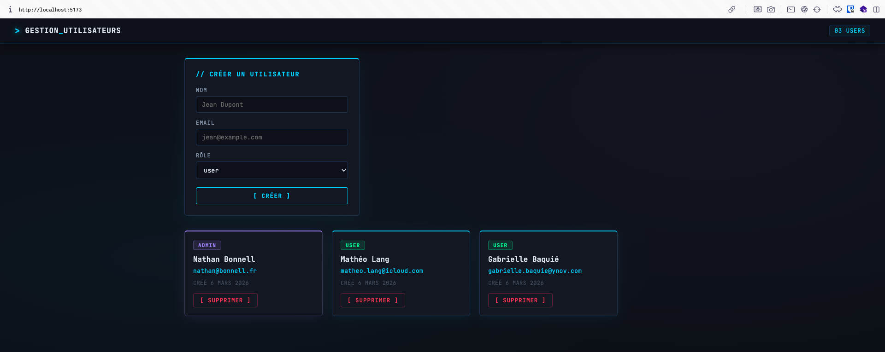

# TP4

## Scénarios de test

1. Lancer le frontend (npm run dev)

2. Remplir et soumettre le formulaire

3. Cliquer Supprimer sur un utilisateur

4. Soumettre le formulaire avec un champ vide

5. Soumettre avec un email déjà utilisé

6. Couper l'API backend (Ctrl+C)

7. Redémarrer l'API, recharger la page

